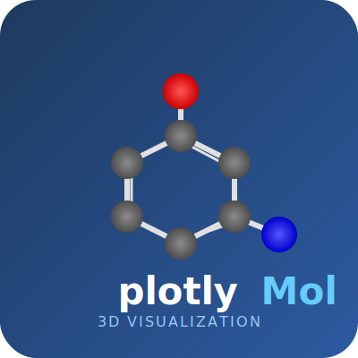

# plotlyMol

<p align="center">
  
</p>


**Interactive 3D molecular visualizations with Plotly**

plotlyMol is a Python package for creating beautiful, interactive 3D molecular visualizations using Plotly. It supports multiple input formats including SMILES, XYZ, MOL/SDF, PDB files, and Gaussian cube files for orbital visualization.

## Key Features

- **Multiple Visualization Modes**: Ball-and-stick, stick-only, and van der Waals (VDW) representations
- **Flexible Input Formats**: SMILES strings, XYZ, MOL/SDF, PDB, and Gaussian cube files
- **SMILES-to-3D**: Automatic 3D coordinate generation from SMILES via RDKit
- **Orbital Visualization**: Isosurface rendering from quantum chemistry cube files
- **Bond Order Display**: Visual differentiation of single, double, triple, and aromatic bonds
- **Interactive GUI**: Streamlit-based web interface for easy exploration
- **Export Options**: Save as interactive HTML or static PNG images

## Quick Example

```python
from plotlymol3d import draw_3D_rep

# Visualize a molecule from SMILES
fig = draw_3D_rep(smiles="CCO", mode="ball+stick")
fig.show()

# Or from an XYZ file
fig = draw_3D_rep(xyzfile="molecule.xyz", mode="ball+stick")
fig.show()
```

## Gallery

<div class="grid cards" markdown>

-   :material-molecule:{ .lg .middle } **Ball and Stick**

    ---

    Classic molecular representation with atoms as spheres and bonds as cylinders

-   :material-vector-line:{ .lg .middle } **Stick Model**

    ---

    Simplified view with small atoms and prominent bonds

-   :material-atom:{ .lg .middle } **Van der Waals**

    ---

    Space-filling representation showing atomic volumes

-   :material-orbit:{ .lg .middle } **Orbital Visualization**

    ---

    Render molecular orbitals from quantum chemistry calculations

</div>

## Why plotlyMol?

### Built on Powerful Tools

- **Plotly**: Industry-leading interactive plotting library
- **RDKit**: Comprehensive cheminformatics toolkit
- **NumPy**: Efficient numerical operations

### Modern Architecture

- Uses Plotly's `Mesh3d` traces for smooth, performant 3D rendering
- Fibonacci sphere algorithm for uniform atom tessellation
- Customizable lighting and materials
- Half-bond coloring for clear heteroatom visualization

### Easy to Use

- Simple API with sensible defaults
- Comprehensive documentation and examples
- Interactive GUI for visual exploration
- Well-tested and CI/CD pipeline

## Get Started

Ready to visualize molecules? Check out the [Installation](installation.md) guide and [Quick Start](quickstart.md) tutorial!

## Community & Support

- **GitHub Repository**: [NCCU-Schultz-Lab/plotlyMol](https://github.com/NCCU-Schultz-Lab/plotlyMol)
- **Issue Tracker**: [Report bugs or request features](https://github.com/NCCU-Schultz-Lab/plotlyMol/issues)
- **License**: MIT License

## Citation

If you use plotlyMol in your research, please cite:

```bibtex
@software{plotlymol2026,
  title = {plotlyMol: Interactive 3D Molecular Visualizations},
  author = {Schultz, Jonathan and Lear, Benjamin},
  year = {2026},
  url = {https://github.com/NCCU-Schultz-Lab/plotlyMol}
}
```
